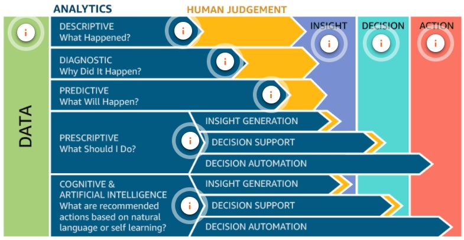

# Introdução a soluções de análise de dados

1. Data Analytics e soluções de análise de dados
- Soluções eficazes de análise de dados exigem armazenamento e capacidade de analisar dados praticamente em tempo real, com baixa latência, gerando retornos de alto valor.
- Os desafios identificados em muitas soluções de análise de dados podem ser resumidos por cinco desafios principais: volume, velocidade, variedade, veracidade e valor.
- O componente de coleta é onde os serviços montam dados de várias fontes.
- O componente de armazenamento armazena dados em repositórios.
- O componente de processo é onde os serviços manipulam dados nas formas necessárias.
- O componente de consumo é onde os dados são apresentados nos formatos necessários.

2. Introdução aos desafios de Data Analytics
- 5 Vs:
  - volume: qtd de dados q serão ingeridos ou tamanho total dos dados recebidos
  - velocidade: rapidez dos dados q entram na solução
  - variedade: nº de fontes que a solução usará
  - veracidade: grau de precisão, exatidão e confiança dos dados
  - valor dos dados: capacidade de uma solução extrair info significativas dos dados que foram armazenados e analisados
- fontes dos dados:
  - Local
  - Streaming de daods
  - Conjuntos de dados públicos

# Volume - armazenamento de dados
- **Dados estruturados** são organizados e armazenados na forma de valores que são agrupados em linhas e colunas de uma tabela.
- **Dados semiestruturados** muitas vezes são armazenados em um conjunto de pares de chave-valor que são agrupados em elementos dentro de um arquivo.
- **Dados não estruturados** não são estruturados de forma consistente. Alguns dados podem ter uma estrutura semelhante a dados semiestruturados, mas outros podem conter apenas metadados.
- Os conjuntos de dados estão cada vez maiores e mais diversificados a cada dia.
- Os dados precisam ser reunidos em repositórios gerenciáveis e centrais, quebrando os silos tradicionais
- Os benefícios da coleta e análise de todos os dados de negócios devem superar os custos.
  
1. Introdução ao Amazon Simple Storage Service (Amazon S3)
- Melhor lugar para armazenar todos os seus dados semiestruturados e não estruturados.
- Armazenar qualquer coisa
- Armazenamento seguro de objetos
- Nativamente online, acesso HTTP
- Escalabilidade ilimitada 
- Durabilidade de 99,999999999%
- o Amazon S3 armazena dados como objetos dentro de buckets. Um objeto é composto de um arquivo e quaisquer metadados que descrevam esse arquivo. Buckets são contêineres lógicos para objetos.
- Depois que os objetos foram armazenados em um bucket do Amazon S3, eles recebem uma chave de objeto. Use isso, juntamente com o nome do bucket, para acessar o objeto. Uma chave de objeto é um identificador exclusivo de um objeto em um bucket.
  

1. Introdução a data lakes
2. Introdução aos métodos de armazenamento de dados

Curation is the action or process of selecting, organizing, and looking after the items in a collection.
Data integrity is the maintenance and assurance of the accuracy and consistency of data over its entire lifecycle.
Data veracity is the degree to which data is accurate, precise, and trusted.

Relational integrity ensures that both members of a relationship remain consistent.
Entity integrity ensures that values within a field remain consistent.

An information schema is a database of metadata containing information on all database objects.

A logical schema lists the constraints, relationships, and properties of tables and views in a database.

## ACID

- Atomicity: atomicity ensures that your transactions either completely succeed or completely fail, 
- Consistency: ensures that all transactions provide valid data to the database, 
- Isolation ensures that one transaction cannot interfere with another concurrent transaction, 
- Durability making sure your changes actually stick even in the event of a system failure.
- It is a method for maintaining consistency and integrity in a **structured database**. The goal of an ACID-compliant database is to return the most recent version of all data and ensure that data entered into the system meets all rules and constraints that are assigned at all times.
- hard state because users cannot access data that is not fully consistent.
- Strong consistency
- Isolation is key
- Focus on committed results
- Conservative (pessimistic) availability

## BASE

- Basically Available: allows for one instance to receive a change request and make that change available immediately
- Soft state: changeable state.
- Eventually consistent: a change will eventually be made to every copy
- It is a method for maintaining consistency and integrity in a **structured or semistructured database**.
- Weak consistency – stale data is OK
- Availability is key
- Best effort results
- Aggressive (optimistic) availability

## ETL/ ELT (Extract, Load, Transform)

- Extract, Transform, Load—is the process of collecting data from raw data sources and transforming that data into a common type
- Amazon EMR is a more hands-on approach to creating your data pipeline. costs may be lower than running the same workload on AWS Glue.
- AWS Glue is a serverless, managed ETL tool that provides a much more streamlined experience than Amazon EMR. 

# Values

- What were total sales in April?

  -Questions relating to past events are answered using descriptive analytics.
- What is the year-over-year total sales for the Asia Pacific region?

  - Questions comparing current data sets to past data sets are answered using diagnostic analytics.
- What is the projected growth for smoking-related hospitalizations next year?

  - Questions looking for predictions of future events are answered using predictive analytics.
- What products should I buy if I like the Seattle Seahawks?

  - Questions looking for recommendations based on preferences or prior purchase history are answered using prescriptive analytics.

- What is the average number of vehicles spotted by my video doorbell?

  - Questions that require analysis of video, images, and voice are answered using cognitive analytics.

## Data preparation

- Remember that there is a process that the data itself must go through to be truly valuable. This process includes:

  - Inspecting data - This first phase is generally part of the planning involved in creating an ETL operation.
  - Cleansing data - This is the process of normalizing the data within the ETL operation to ensure that the fields contain the correct values and to deal with the issue of missing values.
  - Transforming data - This phase involves applying functions to manipulate data into new forms for analytic purposes.
  - Visualizing data - This is the process of building out reports and dashboards to present the value within the data.